# 🚀 COMPLETE GIT + GITHUB + PR + PERMISSIONS + JENKINS CI/CD REVISION GUIDE
### From Beginner → Intermediate → Advanced (Company Workflow)

This README combines **ALL concepts discussed** into one structured revision guide.

You will revise:

- Git basics
- Clone vs Fork
- Branching model
- Ahead / Behind logic
- Pull Requests (UI + CLI)
- Permission model
- 403 errors
- Branch protection
- Fast-forward vs merge commits
- Syncing local & remote
- GitHub vs Git CLI differences
- Jenkins CI with PR
- Enterprise workflow patterns

---

# 📘 LEVEL 1 — GIT FUNDAMENTALS (Beginner)

---

## 1️⃣ What is Git?

Git is a **distributed version control system**.

- Tracks file changes
- Maintains commit history
- Works locally
- Syncs with remote (GitHub)

---

## 2️⃣ Basic Git Workflow

```bash
git clone <repo-url>
git status
git add .
git commit -m "message"
git push
git pull
```

---

## 3️⃣ Local vs Remote

| Location | Description |
|-----------|-------------|
| Local | On your computer |
| Remote | On GitHub |

---

## Data Flow

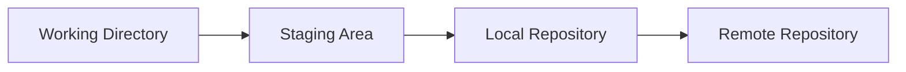

---

# 📘 LEVEL 2 — CLONE vs FORK (Important Concept)

---

## 🔹 Clone

```bash
git clone https://github.com/user/repo.git
```

Creates local copy.

⚠ Does NOT give push permission.

---

## 🔹 Fork

Creates a **new GitHub repository under your account**.

Used when:
- You don’t have write access
- Contributing to open-source

---

## Architecture Comparison

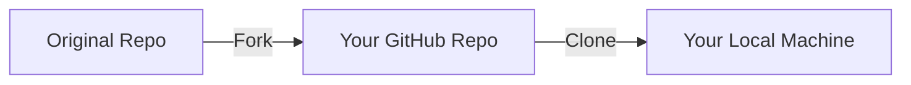

---

## Difference Table

| Feature | Clone | Fork |
|----------|--------|--------|
| Location | Local | GitHub |
| Ownership | Same repo | New repo |
| Push allowed | If permitted | Yes |
| Used for | Team work | Open source |

---

# 📘 LEVEL 3 — BRANCHING MODEL

---

## Why Branch?

Branches allow:
- Isolated development
- Safe experimentation
- Parallel feature development

---

## Create Branch

```bash
git checkout -b feature/login
```

Push:

```bash
git push -u origin feature/login
```

---

## Visual Representation

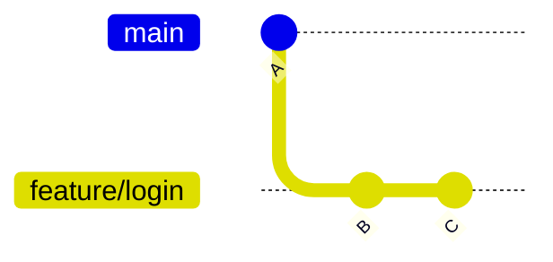

---

# 📘 LEVEL 4 — AHEAD / BEHIND LOGIC

This is critical.

---

## Case 1 — Before Push

You commit locally.

Result:
```
Your branch is ahead of origin by 1 commit.
```

---

## Case 2 — After Push

Local and remote equal.

---

## Case 3 — After Merge on GitHub UI

Remote main has new commit.

Local main does NOT.

Result:
```
Your branch is behind origin/main by 1 commit.
```

---

## Visualization

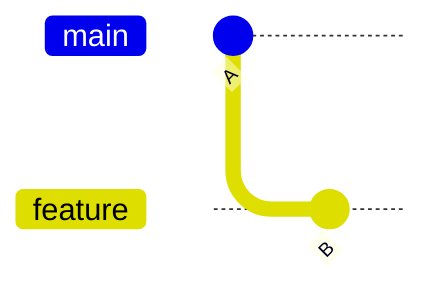

Main → A  
Feature → A → B  
Feature is ahead by 1 commit.

---

# 📘 LEVEL 5 — PULL REQUEST (PR)

---

## What is Pull Request?

A PR is a **request to merge one branch into another**.

Example:

```
feature/login → main
```

---

## Why GitHub asks for Description?

Because PR is:
- A collaboration layer
- A review request
- A documentation entry

CLI doesn’t ask for PR description because:
- Git ≠ GitHub
- GitHub adds collaboration features

---

## PR Workflow

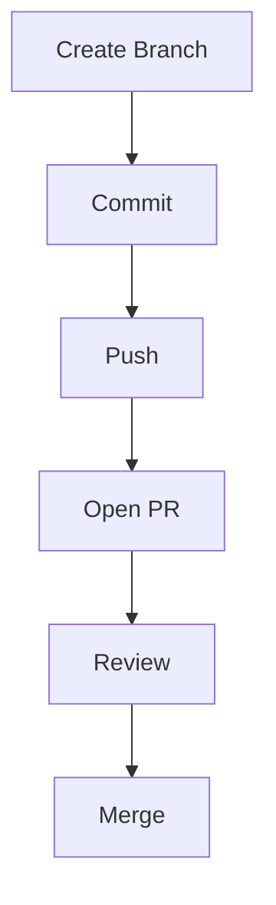

---

# 📘 LEVEL 6 — CLI EQUIVALENT OF PR MERGE

Instead of using GitHub UI:

```bash
git checkout main
git pull origin main
git merge feature-branch
git push origin main
```

Delete branch:

```bash
git branch -d feature-branch
```

---

# 📘 LEVEL 7 — FAST-FORWARD vs MERGE COMMIT

---

## 🔹 Fast-Forward

Occurs when:
- No branch divergence

Git just moves pointer.

Example output:
```
Fast-forward
```

---

## Fast-Forward Diagram

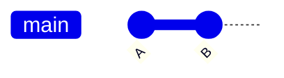

---

## 🔹 Merge Commit

Occurs when:
- Both branches have new commits

Creates merge commit.

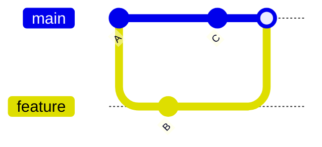

---

# 📘 LEVEL 8 — PERMISSIONS & 403 ERROR

---

## 403 Error Meaning

```
Permission denied (403)
```

You do NOT have write access.

---

## How to Get Write Access

Repo Owner:

```
Settings → Collaborators → Add People → Write
```

---

## Permission Levels

- Read
- Triage
- Write
- Maintain
- Admin

---

# 📘 LEVEL 9 — BRANCH PROTECTION (Enterprise Level)

Even if you have Write access:

Branch protection can block:
- Direct push to main
- Force push
- Merge without PR
- Merge if CI fails

---

## Protected Workflow

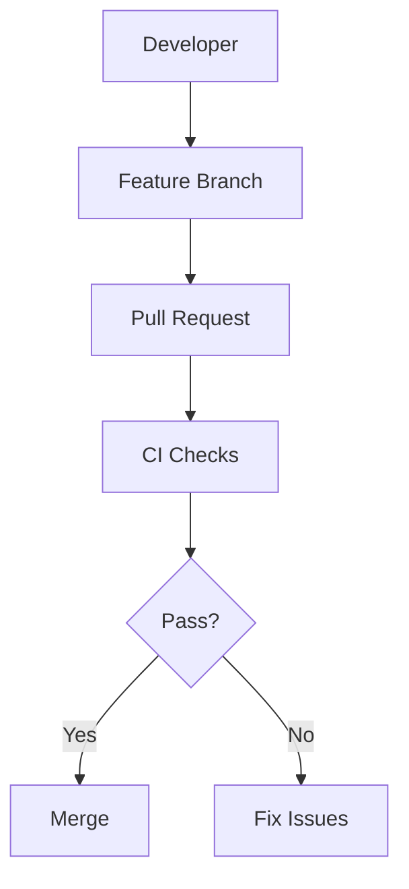

---

# 📘 LEVEL 10 — JENKINS + PR FLOW

When using Multibranch Pipeline:

1. Developer pushes branch
2. PR created
3. Jenkins detects PR
4. Jenkins runs:
   - Build
   - Test
   - SonarQube
   - Docker build
   - Security scan
5. Only if pass → merge allowed

---

## CI/CD Lifecycle

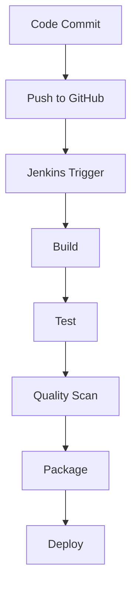

---

# 📘 LEVEL 11 — LOCAL ↔ REMOTE SYNC LOOP

| Direction | Command |
|------------|----------|
| Local → Remote | `git push` |
| Remote → Local | `git pull` |

---

## Sync After Web Merge

```bash
git checkout main
git pull origin main
```

---

# 📘 LEVEL 12 — VISUALIZING BRANCHES

```bash
git log --oneline --graph --all
```

Shortcut:

```bash
git config --global alias.adog "log --all --decorate --oneline --graph"
```

Use:
```bash
git adog
```

---

# 📘 LEVEL 13 — INTERNAL TEAM WORKFLOW

No fork required.

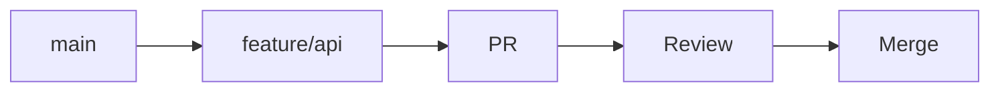

Rules:
- No direct push to main
- CI mandatory
- Review mandatory

---

# 📘 LEVEL 14 — OPEN SOURCE WORKFLOW

Fork model.

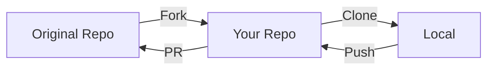

---

# 📘 LEVEL 15 — ENTERPRISE BRANCH STRATEGY

Common pattern:

```
main        → Production
develop     → Integration
feature/*   → Development
hotfix/*    → Emergency Fix
release/*   → Pre-release
```

---

## Enterprise Model Diagram

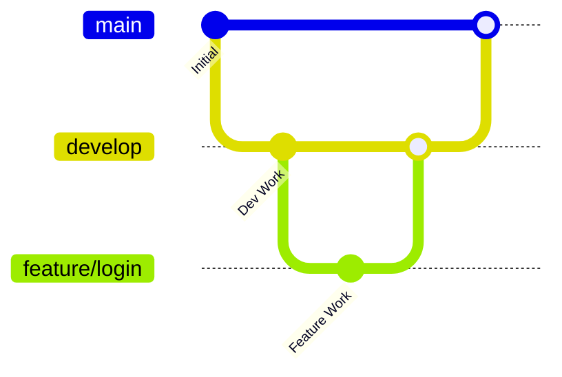

---

# 🏁 FINAL MASTER SUMMARY

You now understand:

- Clone vs Fork
- Branch creation
- Ahead/Behind logic
- Pull Requests
- GitHub vs Git CLI
- Fast-forward merge
- Merge commits
- 403 permission errors
- Write access control
- Branch protection
- Jenkins PR integration
- Enterprise branching strategies
- Syncing local & remote
- Visualizing Git graph

If you fully understand this document, you understand real-world Git + GitHub workflow from beginner to professional company-level DevOps.
