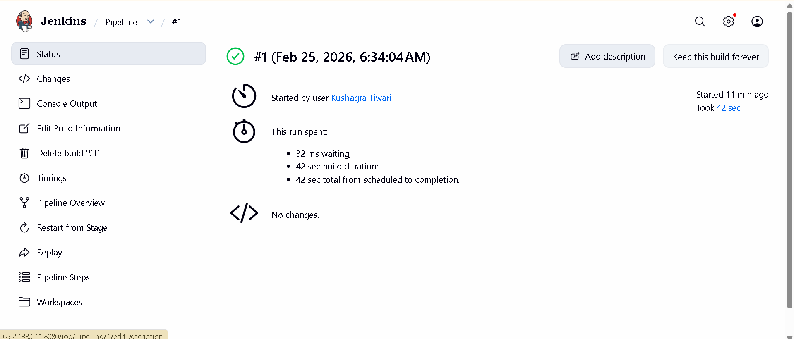
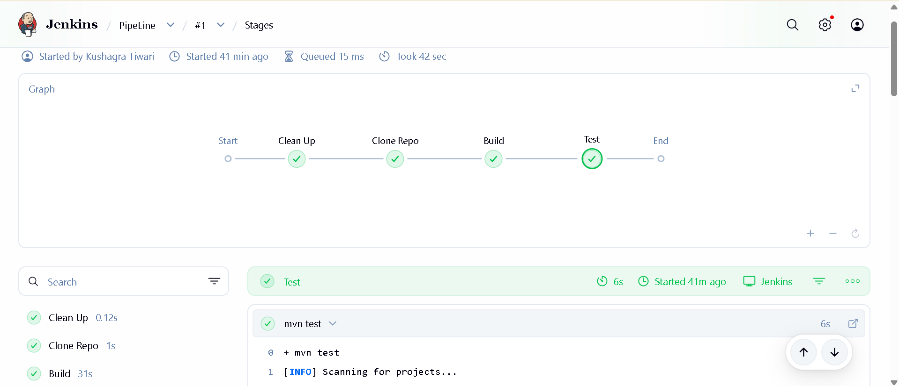
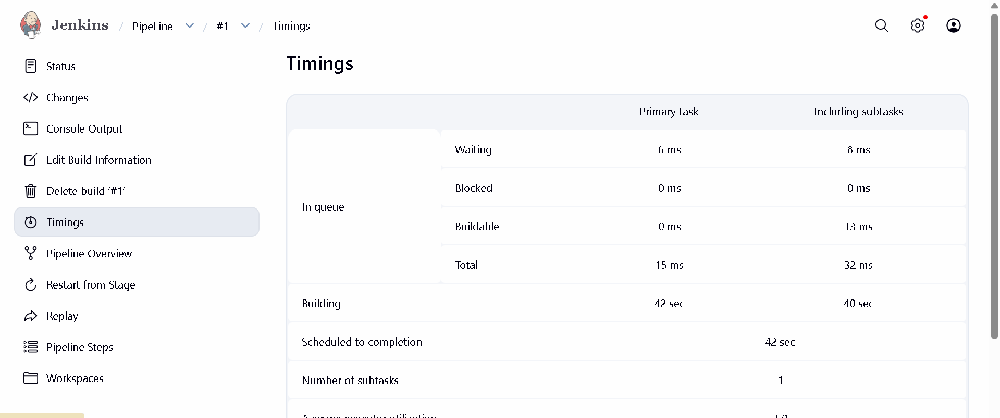

# JobApp - CI Pipeline with Jenkins

<p align="center">
  
</p>

This project demonstrates a complete Continuous Integration (CI) workflow using Jenkins to build and test a Spring Boot application.

---

## Project Overview

This repository contains:

- Spring Boot application  
- Jenkins Declarative Pipeline  
- Automated build process  
- Automated test execution  
- CI pipeline monitoring  

The pipeline ensures that every code change is automatically built and tested.

---

## Tech Stack

- Java 21  
- Maven  
- Spring Boot  
- Jenkins  
- Git & GitHub  

---

## CI Pipeline Workflow

The Jenkins pipeline follows this workflow:

### Trigger
- Manual trigger or GitHub webhook  

### Workspace Cleanup
- Old files removed using `deleteDir()`  

### Source Code Checkout
- Jenkins pulls latest code from GitHub  

### Build Stage
- Maven compiles the project  
- Dependencies resolved  
- JAR file generated  

### Test Stage
- Unit tests executed  
- Spring context loads  
- Build fails if tests fail  

### Build Result
- SUCCESS / FAILURE reported in Jenkins dashboard  

---

## Pipeline Architecture

### Jenkinsfile (Pipeline as Code)

The project uses Declarative Pipeline:

```groovy
pipeline {
    agent any
    stages{
        stage("Clean Up"){
            steps{
                deleteDir()
            }
        }
        stage("Clone Repo"){
            steps{
                sh "git clone https://github.com/kushagra4321gkp-droid/JobApp.git"
            }
        }
        stage("Build"){
            steps{
                dir("JobApp"){
                    sh "mvn clean install"
                }
            }
        }
        stage("Test"){
            steps{
                dir("JobApp"){
                    sh "mvn test"
                }
            }
        }
    }
}
```

---

## Pipeline Screenshots

### Status


### Pipeline Overview


### Timing


---

## Build Performance

| Metric            | Value        |
|------------------|-------------|
| Total Build Time | ~5 seconds  |
| Tests Run        | 1           |
| Failures         | 0           |
| Errors           | 0           |
| Build Status     | SUCCESS     |

---

## Generated Artifact

After successful build:

```
target/JobApp-0.0.1-SNAPSHOT.jar
```

This JAR file can be deployed to:

- Application Server  
- Docker Container  
- Cloud VM  
- Kubernetes Cluster  

---

## Automation Trigger (Optional Enhancement)

The pipeline can be configured with:

- GitHub Webhooks  
- SCM Polling  
- Scheduled Builds  

---

## Future Improvements

- Add Docker build stage  
- Push image to Docker Hub  
- Deploy to Kubernetes  
- Add SonarQube code quality analysis  
- Add Jenkins build badge  

---

## Key Learning Outcomes

- Implemented CI using Jenkins  
- Understood Pipeline as Code  
- Automated build & testing  
- Integrated GitHub with Jenkins  
- Analyzed build logs & test results  

---

## Author

Kushagra Tiwari 
DevOps Enthusiast  

---

## Conclusion

This project demonstrates a foundational CI pipeline setup using Jenkins for a Spring Boot application, ensuring reliable and repeatable builds.

---

