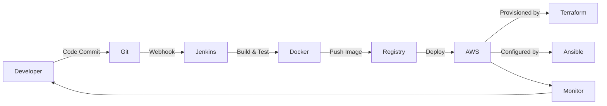
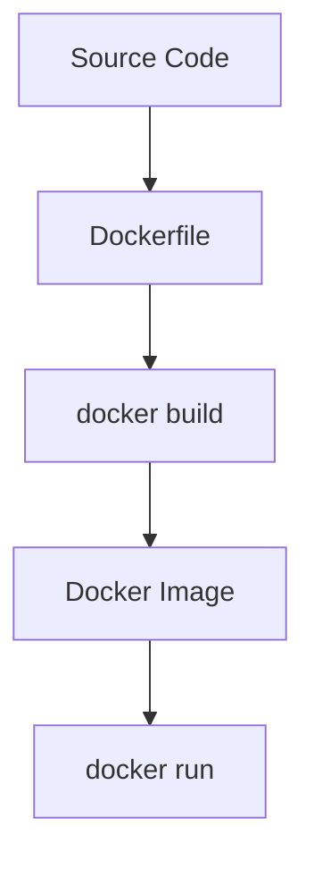
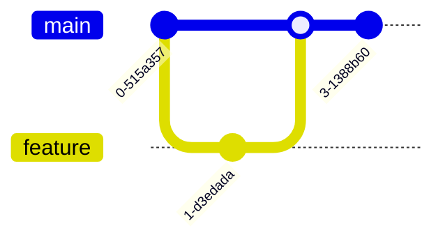
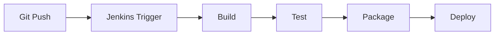
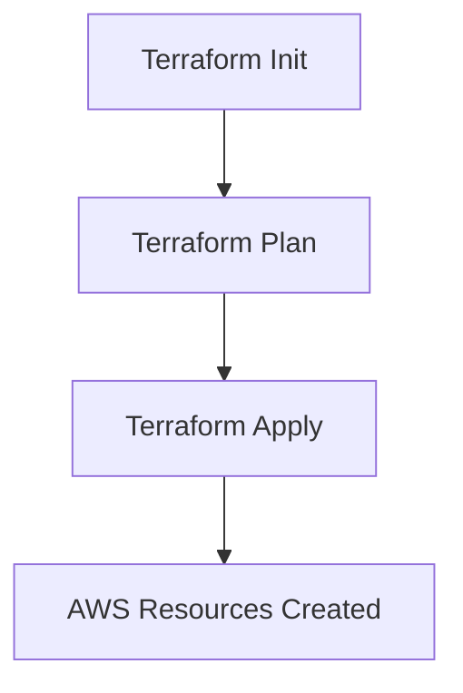
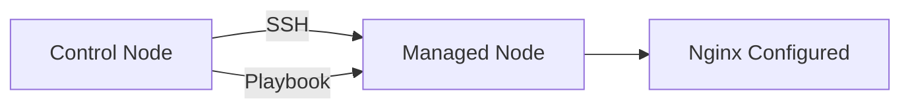
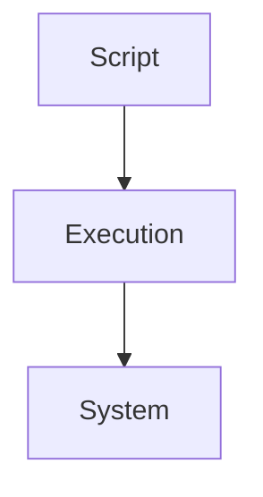
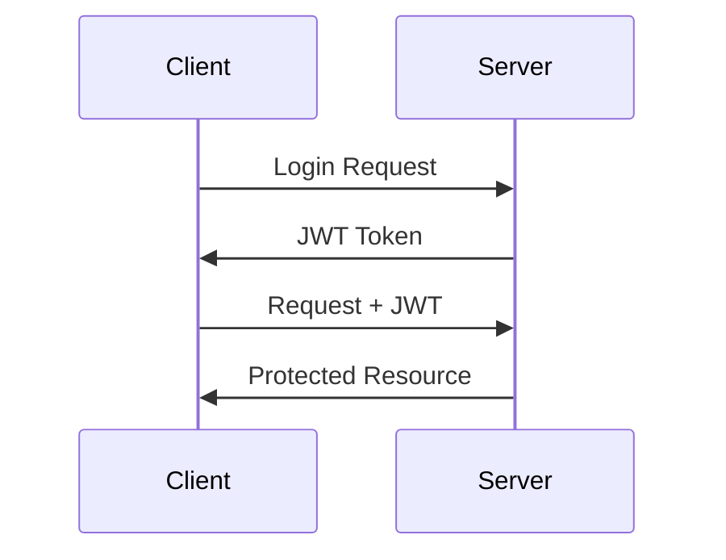
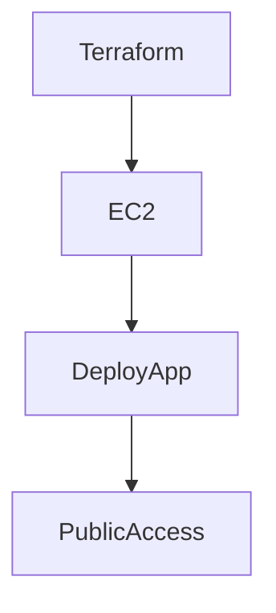

# 👨‍💻 Kushagra Tiwari – DevOps & Backend Engineering Portfolio 🚀

> Personal GitHub workspace focused on DevOps Engineering, Backend Development, Infrastructure Automation, and CI/CD.

---

## 🧭 About Me

I am a DevOps-focused engineer building strong foundations in:

- Linux system administration
- Git & version control workflows
- CI/CD pipeline engineering
- Infrastructure as Code (IaC)
- Cloud computing (AWS)
- Containers & orchestration
- Backend development with Spring Boot

This GitHub account serves as a structured learning lab where concepts are implemented hands-on and organized domain-wise.

---

# 🗂️ Repository Architecture

My repositories are structured by DevOps domains for modular learning and scalability.

```text
DevOps/
│
├── Docker/                # Containerization & image builds
├── Git-n-Github/          # Git workflows, branching, GitHub practices
├── Jenkins/               # CI/CD pipelines (Freestyle + Pipeline as Code)
├── ansible/               # Configuration management automation
├── shell-scripts/         # Linux & bash automation scripts
├── terraform/             # Infrastructure as Code (AWS provisioning)
│
└── README.md
```

---

# 📚 DevOps Learning Coverage

This GitHub workspace covers:

- Linux & Shell scripting
- Git internals & GitHub workflows
- Docker image engineering
- Jenkins CI/CD pipelines
- Ansible configuration management
- Terraform infrastructure provisioning
- AWS cloud deployment
- Backend security (JWT, Spring Security)
- Monitoring & logging fundamentals

---

# 🔄 DevOps Lifecycle Representation



---

# 🐳 Docker Domain

### Focus Areas
- Dockerfile optimization
- Multi-stage builds
- Image layering
- Container networking
- Docker Hub publishing



---

# 🔁 Git & GitHub Domain

### Focus Areas
- Branching strategies
- Rebase vs merge
- Submodules
- SSH authentication
- Git hooks



---

# ⚙️ Jenkins CI/CD Domain

### Implemented Concepts
- Freestyle jobs
- Pipeline as Code (Jenkinsfile)
- Declarative pipelines
- Artifact archiving
- Deployment automation



---

# ☁️ Terraform (Infrastructure as Code)

### Core Topics
- Providers
- Resources
- Variables
- State management
- Remote backend
- EC2 provisioning
- Security Groups



---

# 🔧 Ansible (Configuration Management)

### Focus Areas
- Inventory management
- Playbooks
- Roles
- Nginx server automation
- Idempotent configuration



---

# 🖥️ Shell & Linux

- File permissions (rwx model)
- Process management
- SSH authentication
- Firewall concepts
- Bash scripting automation



---

# 🔐 Backend & Security (Spring Boot)

### Topics Practiced
- JWT Authentication
- Spring Security filters
- Stateless session management
- REST API security
- MySQL integration



---

# ☁️ AWS Exposure

- EC2 provisioning
- SSH key management
- Security groups
- Deployment testing
- Manual + IaC provisioning



---

# 📊 Skills Matrix

| Domain        | Level |
|--------------|--------|
| Linux        | Intermediate |
| Git          | Strong |
| Docker       | Intermediate |
| Jenkins      | Intermediate |
| Terraform    | Intermediate |
| Ansible      | Intermediate |
| AWS          | Intermediate |
| Spring Boot  | Strong |

---

# 🎯 Engineering Philosophy

- Learn by building
- Automate everything possible
- Understand internals, not just tools
- Infrastructure should be reproducible
- CI/CD is mandatory, not optional

---

# 🚀 Future Roadmap

- Kubernetes (EKS)
- Helm charts
- GitHub Actions
- Monitoring stack (Prometheus + Grafana)
- Advanced system design
- Production-grade deployment pipelines

---

# 📌 Account Purpose

This GitHub account is not just for code storage.

It is:
- A structured DevOps journal
- A practical implementation archive
- A foundation-building workspace
- A portfolio for engineering roles

---

# 📬 Contact

Open to collaboration, internships, DevOps roles, and backend engineering opportunities.

---

# 🏁 Final Note

This profile reflects a systematic transition from fundamentals → automation → infrastructure → cloud → security.

All repositories are designed to show progression, not random experimentation.

---

**End of README**
